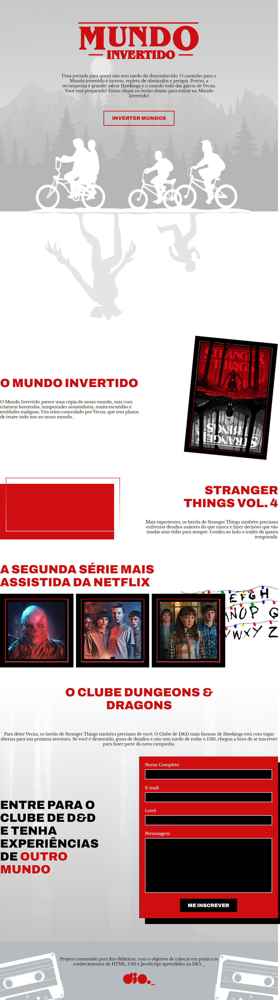

# SEMANA FRONT-END  - DIO

## 👩🏻‍💻 Tecnologias usadas
- HTML
- CSS
- JavaScript

## 💬 Assuntos abordados
- HTML
    - Estruturação da página 
    - Semântica
    - Acessibilidade
    - Web Scraping
    - SEO

- CSS
    - Posicionamentos
    - Pseudo-elementos
    - Pseudo-classes
    - Flexbox
    - Animações 

- JavaScript
    - Introdução ao JavaScript
    - Manipulação do DOM
    - Introdução ao Firebase
    - Integração com o Firebase

🔗 [clique aqui para acessar!](https://antoniellybergami.github.io/semana-frontend-mundo-invertido/)

